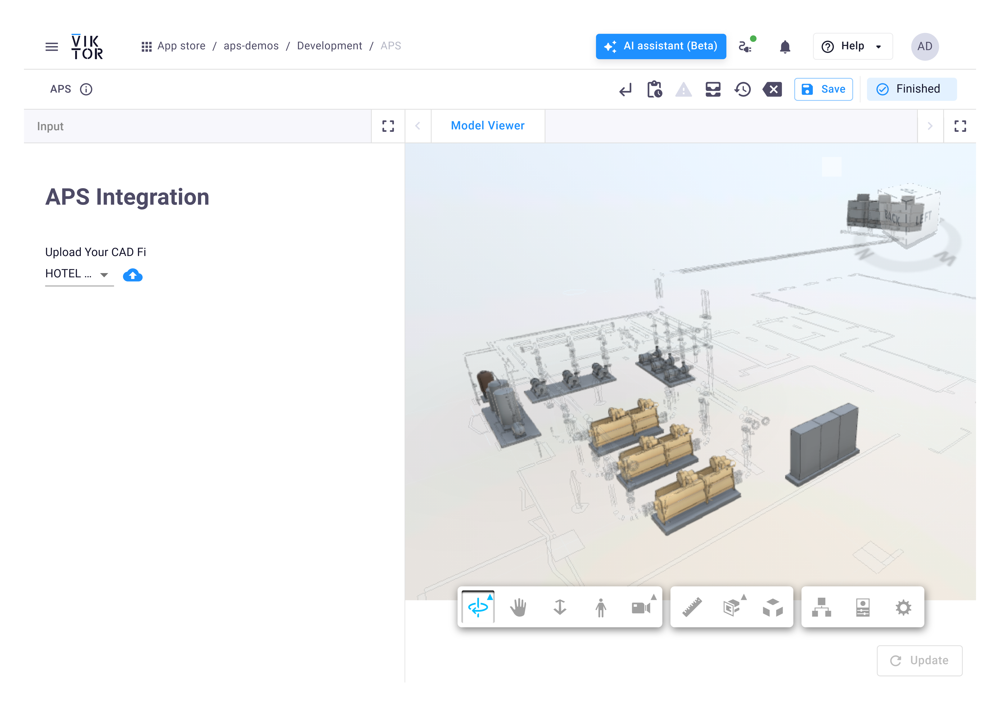
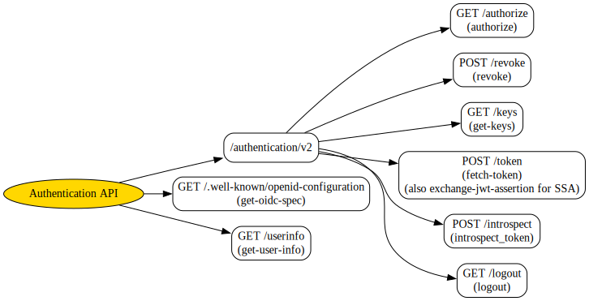
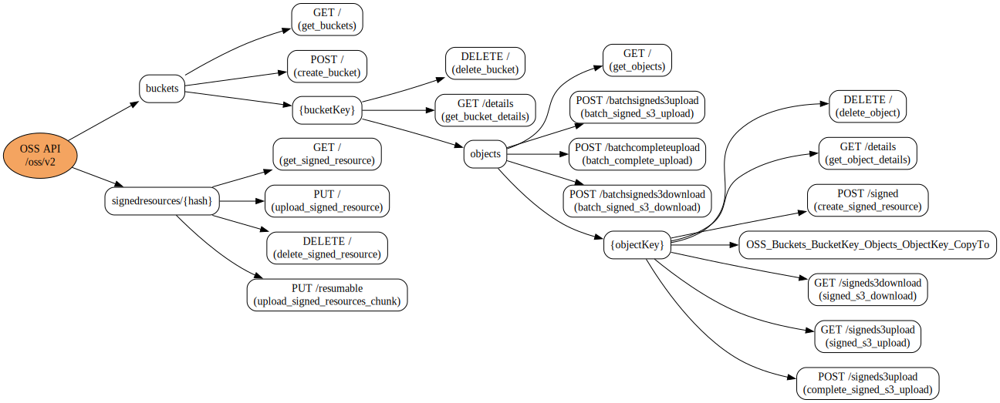
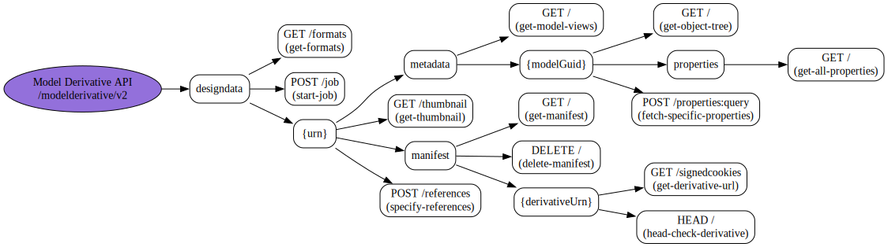

# APS - VIKTOR Sample Integration

This project demonstrates a simple integration between Autodesk Platform Services (APS) and the VIKTOR platform. It showcases how to use the APS Viewer, Object Storage Service (OSS), authentication, and Model Derivative API within a VIKTOR app.



## Authentication (AUTH)

The app uses APS 2-legged authentication to securely access Autodesk APIs. You will need to provide your APS `CLIENT_ID` and `CLIENT_SECRET` as environment variables. The authentication flow is illustrated below:



## Object Storage Service (OSS)

The Object Storage Service (OSS) is used to upload and store design files (such as DWG, RVT, etc.) in Autodesk's cloud. The app automatically creates a bucket (if it doesn't exist) and uploads your file to it. 

> **Note:** This demo creates a unique bucket for each client by using the client ID in the bucket key:
> 
> `BUCKET_KEY = f"viktor-bucket-{client_id.lower()}""`
> 
> This ensures uniqueness and avoids naming collisions.

The process is visualized here:



## Model Derivative API

The Model Derivative API translates uploaded design files into viewable formats (such as SVF) for use in the APS Viewer. After uploading, the app submits a translation job and waits for it to complete. The workflow is shown below:



## Limitations

- This app only includes **2-legged authentication** and is based on OSS.
- To connect with **ACC / BIM 360**, the `Data Management API` must be used, which **requires 3-legged authentication**:  
  https://aps.autodesk.com/en/docs/oauth/v2/tutorials/get-3-legged-token/
- **AutoCAD files with multiple sheets or layouts** require additional logic, which is not included in this app. The same applies to **2D views or sheets from Revit, Inventor**, and other design tools.
- **Selecting specific viewables** (e.g., individual 2D sheets or alternative 3D views) requires parsing the model **manifest** after translation. This logic is not implemented here. To support it, you must:
  1. Retrieve the full manifest once the translation status is `"success"`.
  2. Identify the desired viewable by checking its `role` or metadata.
  3. Use the APS Viewer API to load that specific viewable.

## Environment Variables

To run this application, you need to set your Autodesk Platform Services (APS) `CLIENT_ID` and `CLIENT_SECRET` as environment variables. 
You can do this by creating a `.env` file in the root of your project with the following content:

```
CLIENT_ID=your_client_id
CLIENT_SECRET=your_client_secret
```

Alternatively, you can pass these variables using the VIKTOR CLI. For more details on managing environment variables in VIKTOR, please refer to the official documentation: [Defining environment variables for local development](https://docs.viktor.ai/docs/create-apps/development-tools-and-tips/environment-variables/#defining-environment-variables-for-local-development).

## Test File

A sample Revit file is provided for testing the application. You can download it from the following link:
[Revit Test File](https://drive.google.com/file/d/1d752iVKxvoEkm2xp05YE9cVeZlE3eJqW/view?usp=sharing)
