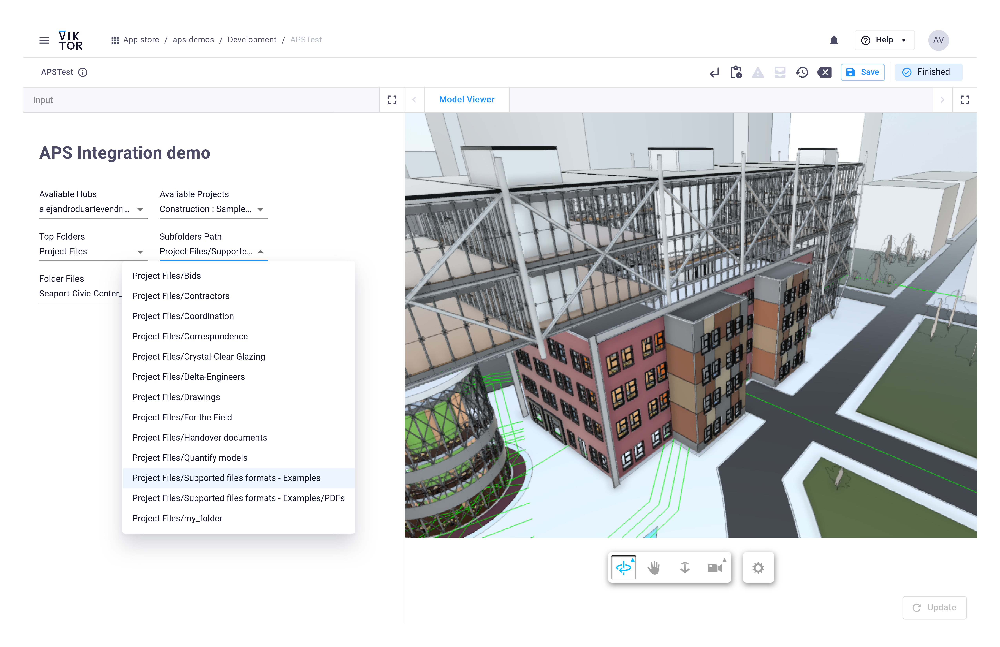

# APS - VIKTOR Sample Integration

This project demonstrates a simple integration between Autodesk Platform Services (APS) and the VIKTOR platform. It showcases how to use the APS Viewer, authentication, and Data Management API within a VIKTOR app.

## Authentication (AUTH)

The app uses APS 3-legged authentication to securely access Autodesk APIs. You will need to set up and [Oauth2 Integration](https://docs.viktor.ai/docs/create-apps/software-integrations/generic/#generic-oauth-20-integration) 

## How It Works

The application's user interface is built with VIKTOR's `OptionField` elements. These fields are populated dynamically using helper functions from [`crud.data_management`](./app/crud/data_management/) which wrap the APS Data Management API ([core.py](./app/crud/data_management/core.py), [helpers.py](./app/crud/data_management/helpers.py)).

Users can navigate their Hubs, Projects, and folders by making selections in these `OptionField`s. To avoid generating an endless interface, all child folders of a selected parent are displayed as a flat list of paths in the  "Subfolders Path" `OptionField`.

The app uses a dictionary where the key is the file name and the value is the formatted URN, which is then sent to the APS Viewer. This dictionary is generated using the [`get_file_urn_dict` helper](./app/crud/data_management/helpers.py). The logic for sending this dictionary and rendering the APS Viewer is handled in the controller method (see [`Controller.show_cad_model`](./app/app.py)).

When a user selects a CAD file, the file name is used as the key to look up the corresponding URN in the dictionary, and a custom HTML view is used to render the model within the embedded [APS Viewer](./app/templates/aps_viewer.html).

